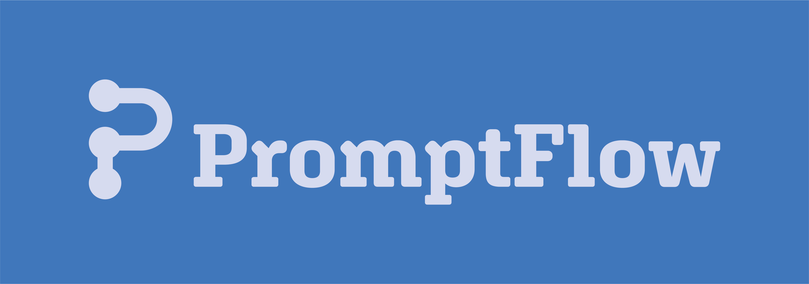
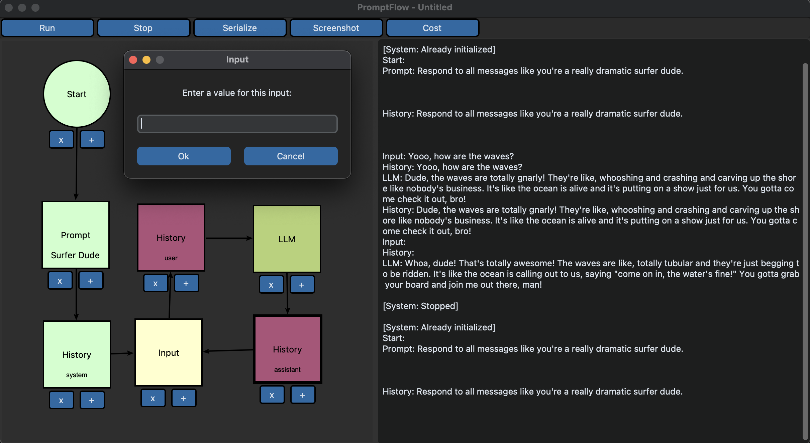

---
# PromptFlow

PromptFlow is a tool that allows you to create executable flowcharts that link LLMs (Large Language Models), Prompts, Python functions, and conditional logic together. With PromptFlow, you can create complex workflows in a visual way, without having to write too much code or deal with complicated logic.



#### Join our Discord: [https://discord.gg/5MmV3FNCtN](https://discord.gg/5MmV3FNCtN)

## How it works

PromptFlow is based on a visual flowchart editor that allows you to create nodes and connections between them. Each node can be a Prompt, a Python function, or an LLM. Connections between nodes represent conditional logic, and allow you to specify the flow of your program.

When you run your flowchart, PromptFlow will execute each node in the order specified by the connections, passing data between nodes as needed. If a node returns a value, that value will be passed to the next node in the flow.

## Initial Setup 

Install the required dependencies. Python 3.8+ is required to run PromptFlow.

`python -m pip install -r requirements.txt`

(If that fails try: `python -m pip install -r requirements-no-nvidia.txt`)

## Launching

Promptflow can be run with Python from the commandline:

```bash
python run.py 
```

If you're having trouble ensure your `PYTHONPATH` is set correctly:

```bash
export PYTHONPATH=$PYTHONPATH:.
```

## Documentation

Official docs website:

#### [promptflow.org](https://www.promptflow.org/en/latest/)

### Building from source

To build the sphinx documentation, run:

```bash
cd docs
make html
```

Then open `docs/build/html/index.html` in your browser.

## Contributing

If you are interested in contributing to PromptFlow, you can do so through [building a node](https://www.promptflow.org/en/latest/development.html#starting-point-adding-a-node).

If you find any bugs, do not hesitate to create an issue or open a PR or let us know in [Discord](https://discord.gg/5MmV3FNCtN).
