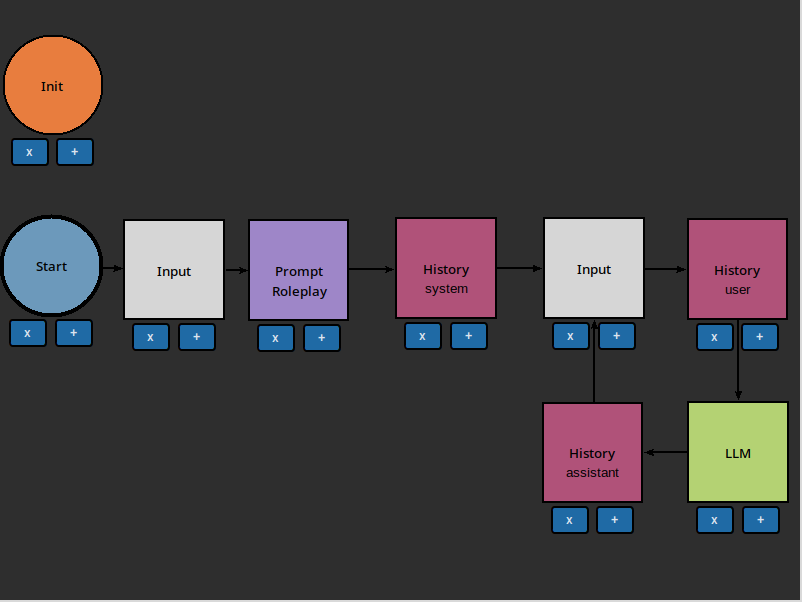
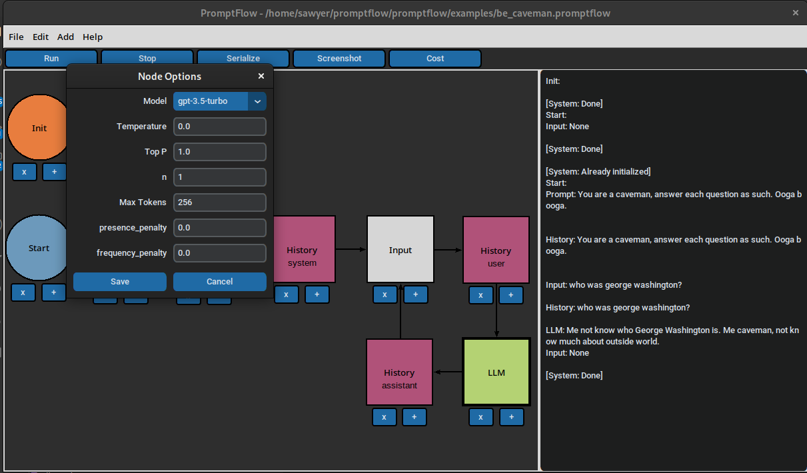
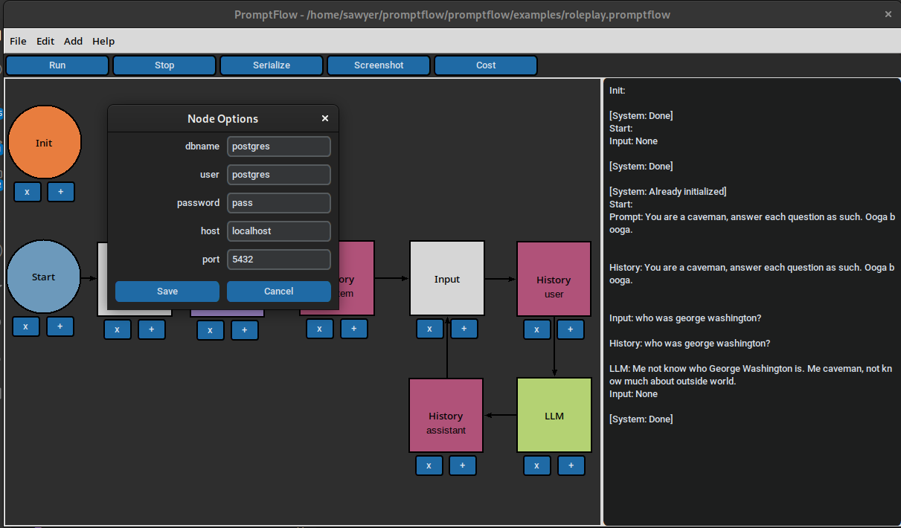
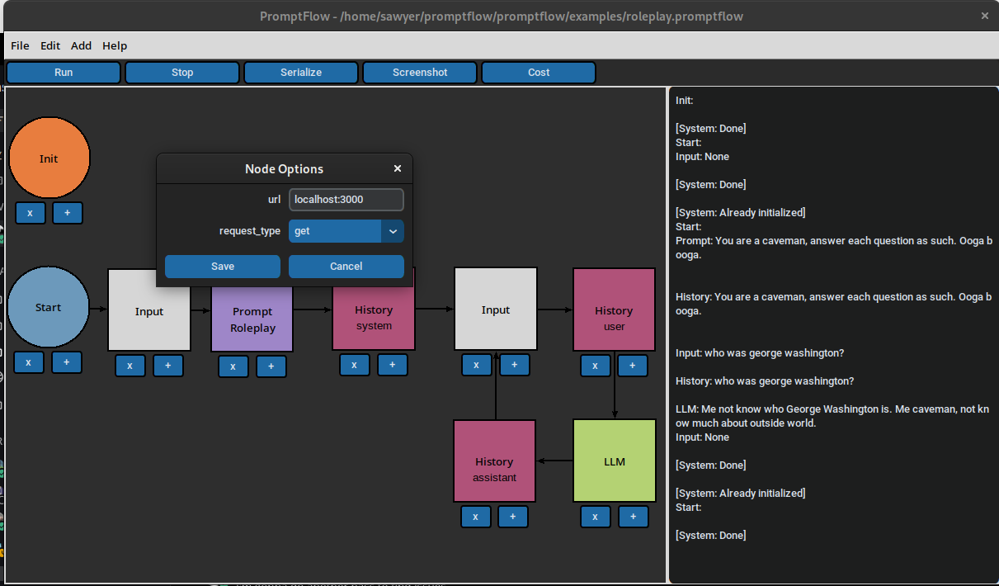

(Node)=

# Nodes

Nodes are the primary building blocks of a Flowchart. They are the individual components that make up a flowchart. Nodes are connected by [Connectors](Connector), and each node has a specific function.

(Init)=

## Init

The Init node is run once and only once at the beginning of the flowchart. It is used to initialize external resources, such as vecstores, embeddings, or databases.

(Start)=

## Start

The Start node is the beginning of your flowchart. It will *always* run first, and can be connected to any other node in your flowchart.

(EnvVars)=

## EnvVars

The EnvVars node allows you to set environment variables.

### EnvNode

Loads a `.env` file. Double-click to set the path to the `.env` file.

### ManualEnvNode

Sets a single environment variable. Double-click to set the key and value.

(Input)=

## Input

### User Input

Pauses the flowchart and waits for user input. Useful for chatbots or interactive programs.

### FileInput

Allows the user to preselect a file. The file output is saved to `state.result` on run.

### JSONFileInput

Parses `key` from `state.result` and opens the file. Double-click to edit the key.

### ServerInput

Wait for a POST request to be made to a server. Defaults to `localhost:8000`. Double-click to edit the server address.

(Output)=

## Output

### FileOutput

Writes the `state.result` to a file. Double-click to edit the file path.

### JSONFileOutput

Parses a filename and a data key from `state.result` and writes the data to the file. Double-click to edit the filename and data key.

(History)=

## History

Saves the output of the previous node to a running history. Useful for chatbots or interactive programs. Follows OpenAI's history scheme, with 3 roles: `assistant`, `user`, and `system`. Double-click the node to edit which role the node will save to.

For a simple example of History Node usage, see [Usage](working-with-llms).

### ManualHistory

Allows the user to manually create an extended conversation history before runtime. Double-click to edit the history.

## HistoryWindow

The [`History`](History) node saves to an "infinite" memory, which isn't feasible for LLMs, which have token limits. The Memory node allows you to apply various windowing strategies to the history.

(WindowedMemory)=

### WindowedHistoryNode

The WindowedHistoryNode node saves the last `n` results of the [`History`](History) node. This is useful for LLMs, which have token limits. Double-click the node to edit the window size.

(DynamicWindowedMemory)=

### DynamicWindowedHistoryNode

The DynamicWindowedHistoryNode node saves the last `n` results of the [`History`](History) node since a target string has appeared in the history. This is useful for LLMs, which have token limits. Double-click the node to edit the window size and target string.


(Prompt)=

## Prompt

Outputs an f-string style formatted string. You can edit the prompt text by double-clicking the lower `Prompt` label on the node.

For a simple example of Prompt Node usage, see [Usage](working-with-llms).

### Usage

To inject the result of the previous node, use `{state.result}`. For example:

```text
You are a {state.result}. Please stay in character, and answer as a {state.result} would.
```

Connecting the following flowchart would allow the user to program any "personality" they want:



(LLM)=

## LLMs

Call to a Large Language Model. Double-click to edit the LLM parameters.



### OpenAI

Call to one of OpenAI's GPT LLMs (`text-davinci-003`, `gpt3.5-turbo`, `gpt4`, etc.).


### Claude

Call to Anthropic's Claude LLM.


(Function)=

## Function

Run an arbitrary Python function. The default function signature is:

```python
def main(state: State):
    return True
```

The signature of `State` is as follows:

```python
class State(Serializable):
    """
    Holds state for flowchart flow
    Wraps a dict[str, str]
    """

    def __init__(self, **kwargs):
        self.snapshot: dict[str, str] = kwargs.get("state", {})
        self.history: list[dict[str, str]] = kwargs.get("history", [])
        self.result: str = kwargs.get("result", "")
```

Where `snapshot` is a dictionary of all the results of previous nodes, `history` is a list of all the results of previous [`History`](History) nodes, and `result` is the result of the previous node.

Right now, any `imports` need to go inside the `main` function. For example, lets create a JSON extractor, which gets a field from a JSON string:

```python
def main(state: State):
    import json
    return json.loads(state.result)["field"]
```


(Date)=

## Date

Outputs the current date and time. Useful for injecting into a [`Prompt`](Prompt) node. Double-click the node to edit the date format.

(Database)=

## Database

Connects to a database and runs a query. Double-click the node to edit the database connection parameters:



(Query)=

### Query

The query node allows you to run a query against a database. The query is `state.result`, so you can use the result of a previous node to generate a query. There are 2 types of queries: `SQLiteQuery` and `PGQuery`, for the 2 supported databases.


(PGML)=

### PGML Support

[PostgresML](https://postgresml.org/) is supported by PromptFlow. Currently, only the `generate` function is supported.

(Generate)=

#### Generate

The Generate node uses a pgml model to complete a prompt. The prompt is `state.result`, so you can use the result of a previous node to select a row. `model` can be selected by double-clicking the node.

(DummyLLM)=

## DummyLLM

You don't always want to hit the LLM API, as it can be expensive. The DummyLLM node allows you to test your flowchart without hitting the API. 

(Embedding)=

## Embedding

Text embeddings are useful for many tasks, such as clustering, classification, and search. The Embedding node allows you to use [Instructor](https://huggingface.co/hkunlp/instructor-large) to embed text, as well as [hnswlib](https://github.com/nmslib/hnswlib) to search the embeddings.

(EmbeddingIngest)=

### EmbeddingIngest

When pointed at a json file, will read all values into database. Usually linked to the [`Init`](Init) node. Double-click the node to point the node to the `.bin` file, and a json file with mappings between the indices and the corresponding values (usually strings).

(EmbeddingIn)=

### EmbeddingIn

Takes data from a node and puts it into an hnswlib index.

(EmbeddingQuery)=

### EmbeddingQuery

Queries an hnswlib index and returns the result. Double click to edit the number of results returned, as well as as the separator between results.

(Http)=

## HTTP

Allows the flowchart to make HTTP requests. Double-click the node to edit the request type (GET, POST, etc), the URL, and the request body. **The `state.result` will be put into the `json` parameter.**



### JSONHttpRequest

Parses a url from `state.result` and makes a request. Double-click the node to edit the url key.


(RandomNumber)=

## RandomNumber

Returns a random number between `min` and `max`. Double-click the node to edit the `min` and `max` values.

(Regex)=

## Regex

Runs a regex on the `state.result`. Double-click the node to edit the regex. Returns the first extracted group.

(TagRegex)=

### Tag

Like the [`Regex`](Regex) node, but extracts text in-between tags. For example, if the `state.result` is `Hello <name>World</name>`, adding `start=<name>` and `end=</name>` would return `World`. Double-click the node to edit the start and end tags.

(StructuredData)=

## Structured Data

### JSON

Validate JSON against a user-provided schema. Double-click to edit the schema.

### Jsonerizer

Converts a string to JSON.

(Search)=
## Search

Nodes that search the web

### SerpApi

Uses [SerpApi](https://serpapi.com/) to search the web using the result of the previous query.

(Test)=

## Test Nodes

Nodes for performing tests on the flowchart

(Assert)=

### Assert

Assert a Python expression. Double-click the node to edit the expression.

(Logging)=

### Logging

Logs the output at a certain step. Useful for debugging. Double-click the node to edit the message. The string is a Python f-string, similar to [`Prompt`](Prompt).

(Audio)=

## Audio

### Whisper Speech-to-Text

Uses [Whisper](https://platform.openai.com/docs/guides/speech-to-text) to convert speech to text. Uses the OpenAI API. Similar to the [`Input`](Input) node.

### ElevenLabs Text-to-Speech

Uses [ElevenLabs](https://beta.elevenlabs.io/) to convert text to speech. Uses the ElevenLabs API.
