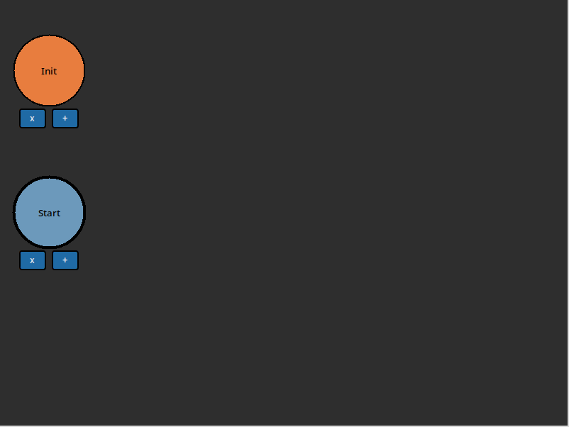
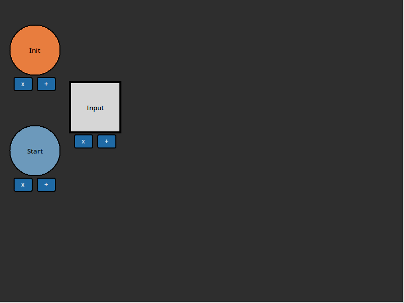
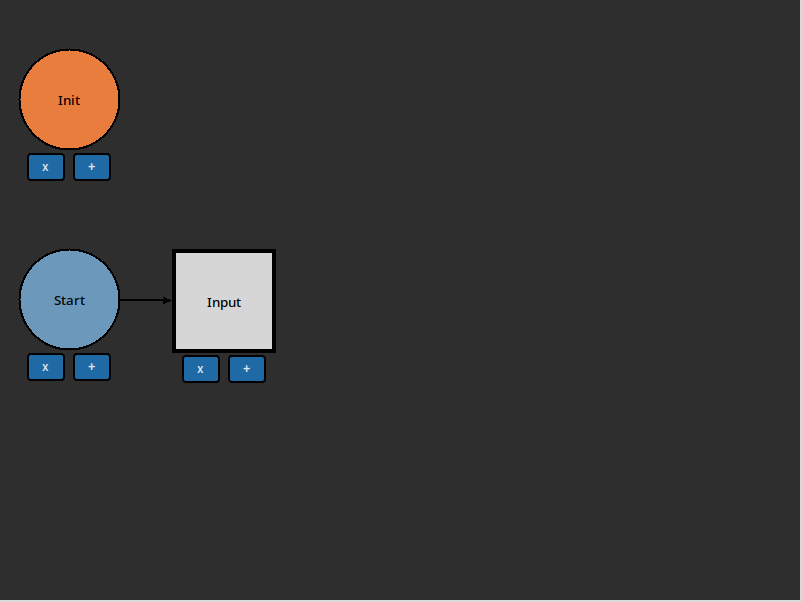
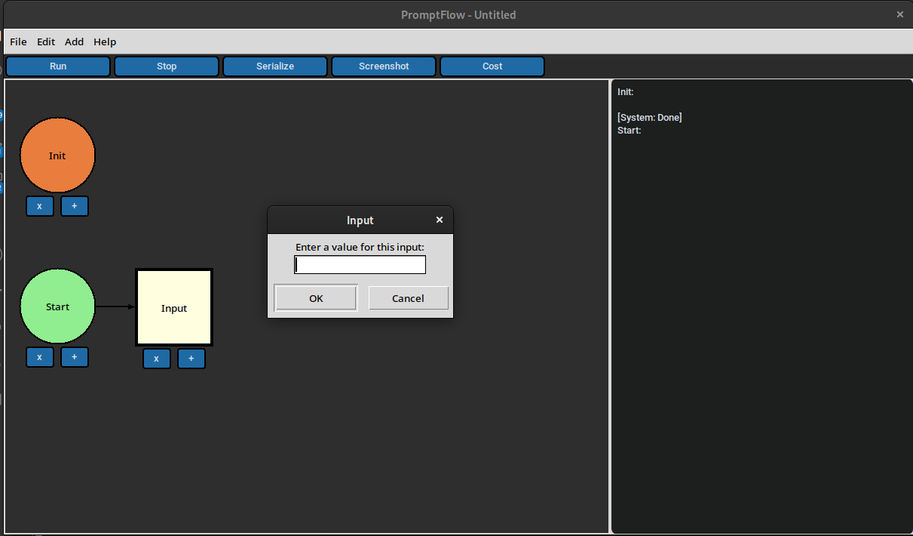
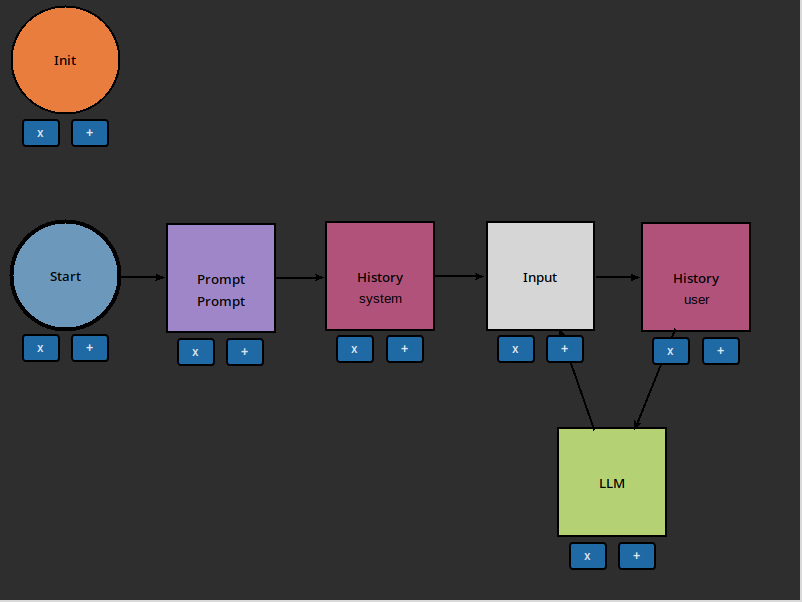
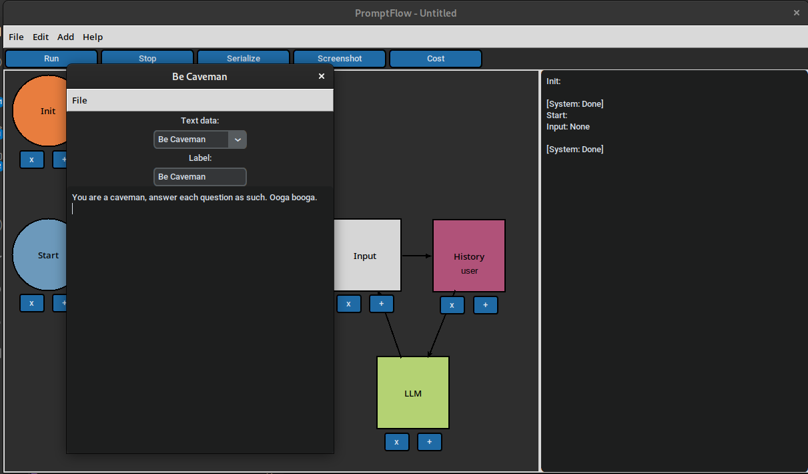
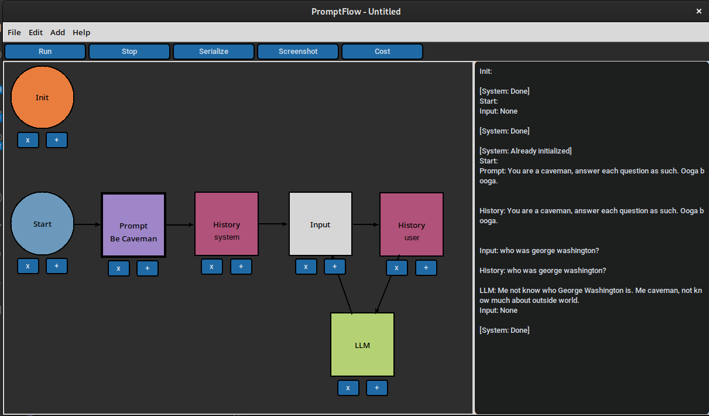

(Usage)=
# Usage

## Creating a flowchart

When you first start the program, you'll see this screen:



The [`Init`](Init) node is run once and only once. Use it for any initialization code you need to run before your flowchart starts, such as connecting to Databases or ingesting embedding files.

The [`Start`](Start) node is the beginning of your flowchart. It will *always* run first, and can be connected to any other node in your flowchart with a [`Connector`](Connector).

### Creating a node

To create a node, click the `Add` menu in the top left corner, and select the type of node you want to create. The node will be dropped into the flowchart. For example, let's add an [`Input`](Input) node, which pauses the flowchart and waits for user input:



Left-click and drag the input node to move it to a better spot.

To add it to the flow, left-click the `+` button under the [`Start`](Start) node, and then left-click the [`Input`](Input) node. You should see a [`Connector`](Connector) between the two nodes:



### Running the flowchart

To run the flowchart, press the `Run` button in the top left corner. You should see the [`Init`](Init) node run, followed by the [`Start`](Start) node. The flowchart will pause at the [`Input`](Input) node, waiting for you to enter some text:



Enter some text, hit `Ok`, and the program should exit.

Congratulations, you've created your first flowchart!


(working-with-llms)=
## Working with LLMs

To use an LLM, we'll introduce 3 nodes- the [`LLM`](LLM), [`Prompt`](Prompt), and [`History`](History) Nodes. Let's make a chat with a caveman. First, build the following flowchart:



Note the cycle at the end of the chart. This will allow us to carry on our conversation with the caveman.

Next, we need to give our AI a prompt to act as a caveman. Double click on the lower [`Prompt`](Prompt) label on the Prompt node to open the prompt editor. Fill out the `Label` and [`Prompt`](Prompt) as follows:



Then, hit `File -> Save` or `Ctrl+S` to save the prompt. You should see the prompt appear in the flowchart:



Now press `Run`, or `F5` to run the flowchart. Let's ask the caveman who George Washington is. You should see the output of each node in the console on the right:

```text
Init: 

[System: Done]
Start: 
Prompt: You are a caveman, answer each question as such. Ooga booga.

History: You are a caveman, answer each question as such. Ooga booga.

Input: who was george washington?
History: who was george washington?
LLM: Me not know who George Washington is. Me caveman, not know much about outside world.
Input: None

[System: Done]
```

That's good, as a caveman probably wouldn't know who George Washington is. Let's ask him about rocks:

```text
[System: Already initialized]
Start: 
Prompt: You are a caveman, answer each question as such. Ooga booga.

History: You are a caveman, answer each question as such. Ooga booga.

Input: what's your favorite kind of rock?
History: what's your favorite kind of rock?
LLM: Me like shiny rock. Shiny rock pretty.
Input: None

[System: Done]
```

Note the system doesn't initialize again, as it's already been initialized.